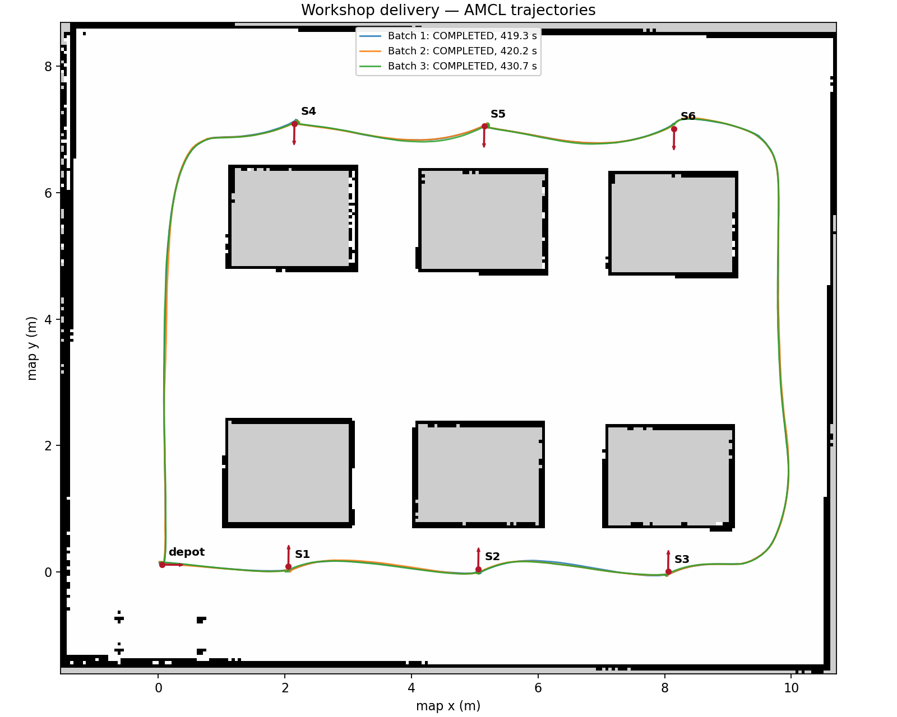

# 车间配送验收记录

本轮固定顺序配送闭环已通过验收（2026-09-21）：统一入口、六工位导航、短路线、
真实暂停/取消测试及连续三批完整配送。测试使用 ROS 2 Humble、Gazebo Classic 11.10.2，
早期验收使用无 GUI 模式、`ROS_LOCALHOST_ONLY=1`，全部任务计时采用 ROS 仿真时间。
后续已补做一批同时开启 RViz/Gazebo 的 GUI 复测并保存全过程截图，见下文。

[机器可读结果](acceptance_results.json) 保存关键原始结果、配置哈希和接口记录。
完整事件、轨迹及配置快照保留在工作空间 `runs/`，不作为源码提交。

## 已验证

- 配置与状态机：25 项 pytest 测试通过，覆盖配置拒绝、取消屏障、过期回调、超时重试、
  卸货完成和到站的区分、暂停剩余时间以及时钟回退。
- ROS 异步协议：`runs/protocol_20260921T073849/protocol_result.json` 记录通过。
  使用独立 ROS 域中的假导航服务器，覆盖延迟接受、重复开始、暂停继续、取消、卸货暂停、
  不可达目标重试失败；同时活动目标最大数量为 1。这不是 Gazebo 实际导航。
- 工作空间相关 11 个包构建通过；构建日志为 `runs/diagnostics/build_delivery_final.log`。
- 保存地图及工位文件通过哈希绑定和自由空间检查。地图边界配准残差约 0.0087 m；
  该数值描述地图几何配准，不代表 AMCL 的实际定位精度。

## 实际导航（2026-09-20）

最终参数下 15 个导航目标全部通过：六个工位分别往返物料站，以及
物料站 → S1 → S5 → 物料站的跨排路线。单目标耗时 27.6～128.3 ROS 秒，
停车后的最大 map 位姿误差为 0.0802 m、0.0730 rad。
两次连续运行均未检测到底盘/车轮包络与静态设备、墙体或料架重叠。

原始记录：

- `runs/validation_20260920T223258_123fa9/results.json`：S1、S3 往返。
- `runs/validation_20260920T223807_0f8df9/results.json`：S2、S4、S5、S6 往返和跨排。

后续配送和异常测试采用扩大到前部传感器的保守包络进行额外检查。
地图位姿容差不等于 Gazebo 真值定位精度，真值比较结果一并保留在记录中。

## 实际异常操作（2026-09-21）

`runs/validation_20260921T073808_d28070/results.json` 通过：

- 忙碌时拒绝第二次开始。
- 导航中暂停、确认取消旧目标后继续，再取消整批并停车；取消后没有在途目标。
- 卸货中暂停保留剩余时间，到站尚未标记交付完成。
- 暂停 Gazebo 后连续两秒墙钟观察到 ROS 时钟保持不变；恢复后完成剩余卸货。
- 卸货完成才将 S1 计入已交付，随后取消测试批次并返回物料站。

测试批次按预期以 CANCELLED 结束，不计入后续无干预配送成功批次。
该测试已使用包含前部传感器的保守包络检查，未检测到障碍重叠。

## 短路线配送（2026-09-21）

`runs/validation_20260921T074235_cd0597/results.json` 记录整批 COMPLETED：
物料站 → S1 → S3 → S5 → 物料站，用时 327.0 ROS 秒，轮式里程计距离 32.62 m。
三次卸货均为 5.0 ROS 秒，零重试，未检测到包含前部传感器的机器人包络与障碍重叠。
验收脚本重新读取落盘事件，核对了交付顺序、服务等待时间、导航结果和返回事件。

## 连续三批完整配送（2026-09-21）

同一仿真会话、相同配置，连续执行 `depot → S1 → S2 → S3 → S6 → S5 → S4 → depot`。
三批均为 COMPLETED，途中无人工接管、无重试、无超时；18 次卸货均为 5.0 ROS 秒。
真值共采样 25,624 次，未检测到包含雷达/相机的保守机器人包络与静态障碍重叠。
21 次到站（含回程）的最大 map 误差为 0.0788 m、0.0646 rad。
三批配置快照的全部哈希完全相同。

| 批次 | ROS 耗时 / s | 轮式里程计距离 / m | 原始日志目录 |
|---|---:|---:|---|
| 1 | 419.3 | 32.66 | `runs/20260920T234843_417f727b` |
| 2 | 420.2 | 32.69 | `runs/20260920T235545_d5485146` |
| 3 | 430.7 | 32.71 | `runs/20260921T125355_a67ce6a2` |

验收汇总为 `runs/validation_20260921T074839_15723f/results.json`。
每批目录含事件 CSV、轨迹 CSV、终态汇总及地图/导航/世界/车轮接触配置快照。
批次目录时间使用 UTC；验收脚本目录使用本地时间。任务耗时不使用目录时间相减。

图中轨迹来自 map 位姿，距离统计来自连续轮式里程计增量，二者口径不同。

## 调试中发现的问题

1. 动作服务出现早于 Nav2 生命周期激活，验收脚本首个目标曾被拒绝。
   脚本现等待生命周期、时钟、TF 和真值数据就绪后才发送目标。
2. 四轮滑移底盘的车轮惯量轴和摩擦方向需要与 URDF 的轮轴一致。
   已改为 Y 轴惯量与 collision 局部轮轴摩擦方向，并调整接触刚度、阻尼。
3. 早期 RPP 配置在 S3 回程因路径靠近设备而触发碰撞预测，验收未通过。
   已提高障碍膨胀半径至 0.55 m、近障减速距离至 0.40 m，最终参数复测已通过。
4. 末端转向时，控制器使用过小的速度请求导致静摩擦下无法起转。
   仿真配置采用 RPP；转向请求加速参数独立于最终速度平滑器，最终限速仍为
   0.15 m/s 和 0.4 rad/s，加速度限制为 0.3 m/s² 和 0.8 rad/s²。

调参中的成功点位不纳入正式整套验收。原始成功和失败尝试均保留在 `runs/`，
该目录不提交源码。实际到站判据为停车后的 map 位姿误差不超过 0.10 m、0.10 rad；
Gazebo 真值只用来检测包络重叠和评估定位误差，不反馈给配送执行器。

## GUI 完整配送复测与截图（2026-09-21 22:35～22:42）

同时开启 RViz 和 Gazebo，重新执行一批完整路线，无人工接管：
`depot → S1 → S2 → S3 → S6 → S5 → S4 → depot`。

- 终态 COMPLETED，耗时 **431.5 ROS 秒**，轮式里程计距离 **32.7077 m**。
- 六次卸货均为 **5.0 ROS 秒**，零重试，七次导航（含回程）均成功。
- 停车后 map 估计位姿最大误差：**0.07187 m、0.05755 rad**，满足 0.10 m、0.10 rad。
- Gazebo 真值包络检查采样 **8,733 次**，未检测到设备、墙体或料架重叠。
- 配置和状态机 **25 项单元测试重新通过**。
- 保存 **15 张 1920×1080 原始 PNG**，每张同时包含 RViz 和 Gazebo；
  覆盖待命、各段导航、六工位卸货、回程和完成。
- 新增只读截图脚本 `scripts/capture_delivery.py`，通用版本也在本次真实回程和完成阶段运行验证。

[截图、图注与本次原始记录](../../../artifacts/workshop_delivery_gui_20260921/README.md) ·
[完整素材 ZIP](../../../artifacts/workshop_delivery_gui_20260921.zip)

原始批次：`runs/20260921T143531_34238fcb`；
验收：`runs/validation_20260921T223527_fe088e/results.json`。
素材目录另存一份配置快照、事件、轨迹及验收结果，避免只有图片无法追溯。
截图是直接抓取同一桌面的真实画面，未经拼接或重绘；状态旁录与 GUI 渲染异步。
本次没有重新执行此前全部异常测试或连续三批测试，这些仍以前面的独立记录为依据。

## 真值逐段融合与七段途中截图复测（2026-09-22）

重新实际完成一批 `depot → S1 → S2 → S3 → S6 → S5 → S4 → depot`，
终态 COMPLETED，用时 **423.3 ROS 秒**，轮式里程计距离 **32.7081 m**。
六次卸货各 5.0 ROS 秒、零重试；最大到站 map 估计误差 **0.07537 m、0.06110 rad**。
独立验收节点检查了 **8,569 次**真值包络，未检测到静态障碍重叠。25 项单元测试重新通过。

本次新增可追溯证据：

- 保存 **8,479 条**连续 Gazebo 真值采样，最大接收 ROS 时间间隔 0.1 s。
- 七段原始 CSV 依次读回合并，合并文件与连续原始 CSV **逐行相等，SHA256 相同**。
- 整批实际轨迹图按七段实测位置着色生成，无平滑、无按工位补造路径。
  Gazebo 原始位置相邻点累积距离为 **34.1489 m**，与轮式里程计统计分别保存。
- **七段行驶途中各一张截图**，包含出发和回程；按实际行驶距离约半段触发，
  距目标超过 0.6 m。另有六次卸货和最终完成，共 **14 张 1920×1080 原始双窗口图**。
- RViz 紫红线实时显示累计真值轨迹，绿色线表示当前规划；完成截图直接显示完整闭环。
- 分别保存真值融合图、AMCL 对照图、规划汇总图与各段独立图。

[本次图注、轨迹来源与原始记录](../../../artifacts/workshop_delivery_gui_20260922/README.md) ·
[完整素材 ZIP](../../../artifacts/workshop_delivery_gui_20260922.zip)

原始批次 `runs/20260922T134748_ae719cf1`，
验收 `runs/validation_20260922T214744_3e2229/results.json`。
真值记录从首次收到新批次活动状态开始，至完成后约一秒；ModelStates 无 header，
时间采用接收时 ROS 时钟。地图叠加使用原有固定 world→map 标定，不重新拟合。

上一张 2026-09-21 轨迹图来自 862 条 AMCL 位置采样；从原始日志重新生成的图片
与旧图 SHA256 相同。它属于定位估计轨迹，不能称为 Gazebo 真值；
核查依据另存为本次素材中的 `previous_plot_audit.json`。

## 验证范围与后续工作

- 已完成无窗口验收和一批 GUI 复测；双窗口截图、图注及日志均已保存。
- 不可达目标的失败/重试协议由独立假导航服务器覆盖；实际 Gazebo 的暂停、取消和时钟暂停另行验证。
- 0.10 m、0.10 rad 是停车后的 map 估计位姿容差。导航记录中 AMCL 与配准后的 Gazebo 真值
  最大平移差约 0.204 m，不能据此声称真实装卸定位达到 0.10 m。仿真接触参数也不是实车动力学标定。
- 代价矩阵、截止期模型、NSGA-II、多机器人、动态插单及机械臂装卸尚未实施，属于后续阶段。
