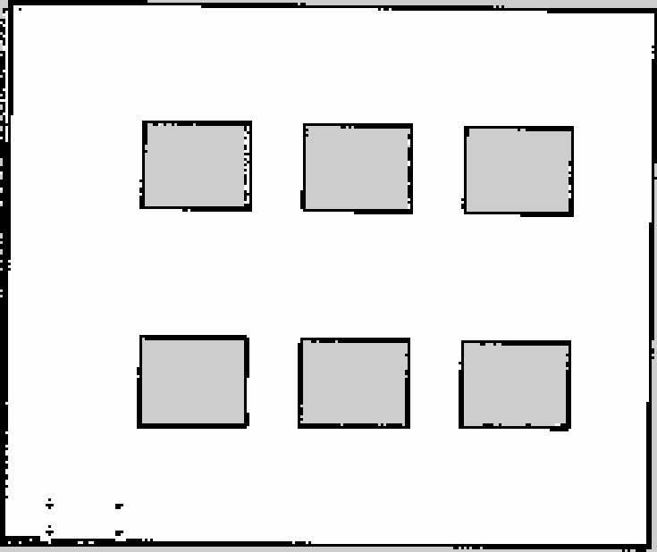

# 车间仿真建图记录

日期：2026-09-19。使用当前六设备 world，Gazebo Classic 11.10.2、ROS 2 Humble、SLAM Toolbox。
地图由机器人实际行驶时的 `/scan` 和 TF 建立，未从 world 几何直接生成或人工补画。

## 结果

- 地图：`../maps/workshop_delivery_v1.yaml` 和同名 `.pgm`。
- 分辨率 0.05 m/cell；尺寸 245×206；原点 `[-1.54, -1.61, 0]`。
- Nav2 map_server 已成功加载并激活；订阅重载地图确认自由/占用/未知栅格数量与原文件完全一致；地图包重新编译安装成功。
- 自由栅格 39208、占用栅格 3287、未知栅格 7975；最大自由连通区域占自由栅格 99.679%。
- 按出生点近似换算的物料站及六工位候选点位于同一自由连通区域，距非自由栅格至少 0.60 m。
- 这些坐标检查不能替代 AMCL 初始化、正式工位标定及 Nav2 到点测试，后者尚未执行。



白色为自由区，黑色为障碍，灰色为未知。设备内部不可观测，因此保留为未知。
物料架在激光扫描高度主要表现为左下角的支柱，地面工位标记没有碰撞体，不进入地图。

## 采集过程

机器人出生于 world `(1.5,1.5)`，使用仿真时间，以不超过 0.15 m/s 的速度巡航。
控制器依据 SLAM 的 `map → base_footprint` 位姿闭环跟踪通道目标，并以正前方激光距离检查停车条件。
路线经过下侧、右侧、上侧、左侧、中央通道，再经右侧和下侧返回物料站，7 段全部完成。
规划通道折线约 51.6 m，此数不是实测里程。
只有本次巡航节点向 `/cmd_vel` 发布速度；完成后发布零速度并退出。

原始巡航位姿采样、检查结果和 world 哈希见 `workshop_delivery_v1_mapping.json`。
名义自由区域覆盖检查使用出生点平移近似，排除了墙边 0.2 m、设备外扩 0.15 m 和料架区域；
此区域已知栅格比例为 100%，不代表整幅地图或障碍物内部都已观测。

## 复现入口

```bash
ros2 launch gasrobot_simulation workshop_delivery.launch.py gui:=false
ros2 launch gasrobot_gas_mapping mapping.launch.py use_sim_time:=true
```

以上分别在两个已 source 工作空间的终端运行。使用键盘遥控沿上述通道采集后，停车并保持 SLAM 运行，再保存：

```bash
ros2 run nav2_map_server map_saver_cli \
  -f src/gasrobot_gas_mapping/maps/workshop_delivery_v1 \
  --ros-args -p use_sim_time:=true -p save_map_timeout:=10.0 \
  -p free_thresh_default:=0.196 -p occupied_thresh_default:=0.65
```

保存命令在工作空间根目录执行，会覆盖同名地图；重新采集时可换用新文件名。
`free_thresh=0.196` 保证灰度 205 的未知区重载后仍为未知。
